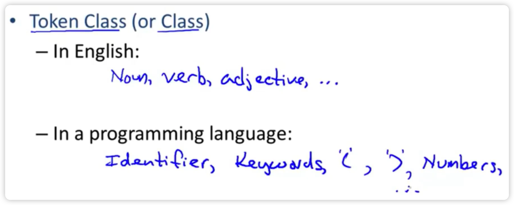
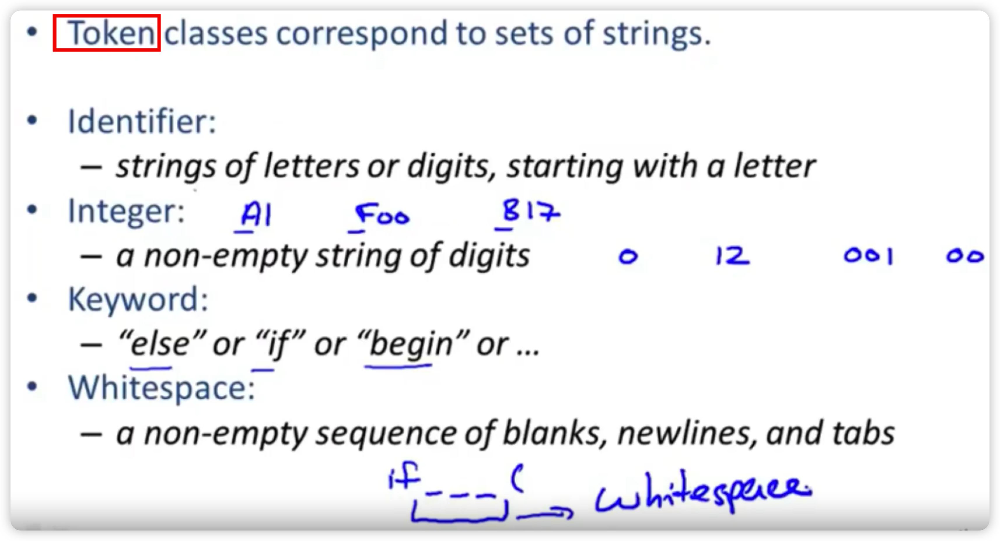
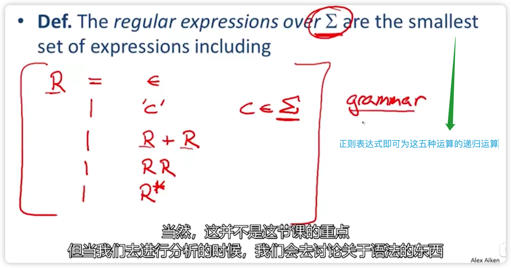
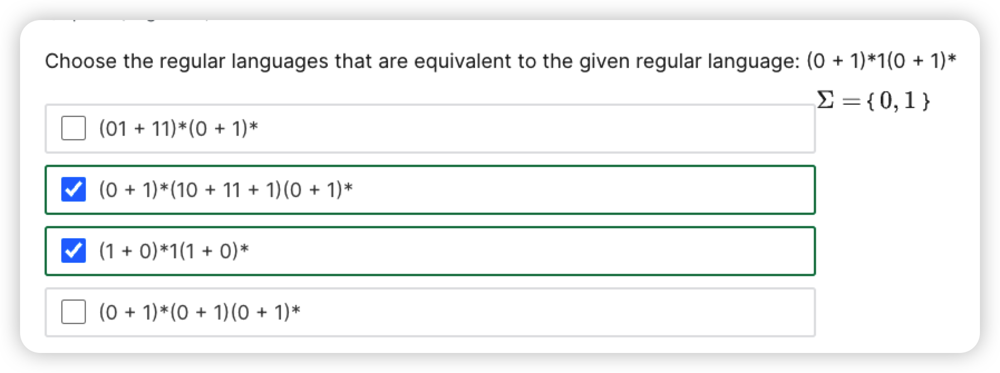
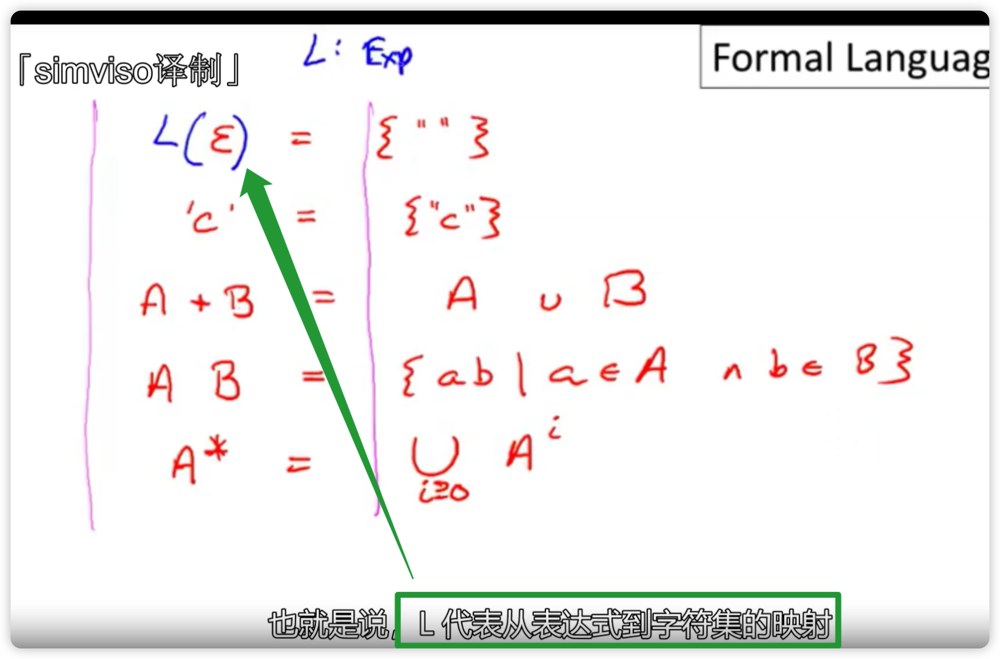
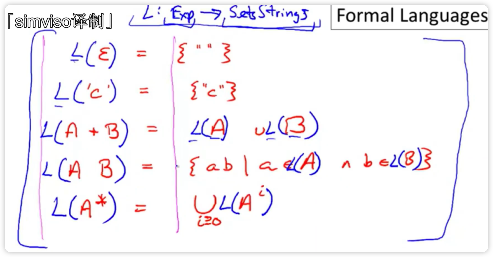

<p align="center">
 
 <h1 align="center">Compilers</h1>
 <p align="center"><b>斯坦福大学-编译原理</b></p>
</p>

<div align=center>


[](LICENSE)


<div align=left>
<!-- 顶部至此截止 -->


[toc]


# Week 1 简介 & Cool 语言

> Introduction & the Cool Programming Language


## 简介

课程主要讲的是**编译器**。本课程的项目目的是构建一个完整的编译器，特别是将 COOL 编译成 MIPS 汇编语言。几乎所有机器上都能够模拟 MIPS 汇编语言。


**实验过程：**

1. 编写一个 Cool 程序

    该程序本身将做解释器提供一些编写简单解释器的经验

2. 词法分析

3. 语法解析

4. 语义分析

5. 代码生成

所有以上的阶段强调的都是**兼用可插拔性**，针对的对组件进行测试，以便不会影响其他模块


---


**实现编程语言主要有两种方式：**

- **编译器 - Compilers**

    执行和编译是两个阶段。执行属于线上的话，相对解释器来讲。它需要结合合数据进行执行。此处编译器没有执行步骤，所以属于线下（off-line）

    

    

- **解释器 - Interpreters**

    我们把 Program 和 Data 作为 Input，通过解释器之后打到 Output

    在解释器执行程序之前，它不需要对这个程序做任何处理。直接把 Program 和 Data 丢过去就好了，可以说，解释器是程序运行的一部分（on-line）。

    

---


### 编译器结构

> 总结：
>
> 01-01 Introduction
>
> 01-02 Structure of a Compiler 编译器结构


世界上第一个编译器是 FORTRAN 1，由 IBM 公司花费 3 年开发（本来是预计 1 年就可以完成）。**它的影响十分深远，现代编译器依旧保留了它的框架**


**FORTRAN 1 的结构：**

**几乎**所有的编译器都经历了这些阶段，但近几年有所改变

1. **词法分析** - Lexical Analysis

    Lexical analysis divides program text into "**word**" or "**tokens**"

    词法分析的目标是将程序代码文本按照它的方式进行**分词**；换句话说就是**编译器对词与词法单元的区分**

    

    `tokens`：

    - 关键词（if、else）
    - 分隔符（空格）
    - 常量
    - 变量
    - 运算符（等号、双等号）

    

    问题：思考为啥如何避免 `==` 被识别成两个 `=`

    

    **语义树分析：**

    

    

    **需要解决的问题：**

    - 二义性问题（语境中的歧义）
    - 类型检查

    

2. **词法解析** - Parsing

    1 与 2 共同关注了语法方面

    

3. **语义分析** - Semantic Analysis

    比如：类型和作用域规则

    

4. **优化** - Optimization

    如何使程序占用更少的内存。修改代码使程序占用更少的资源。

    

    比如可以将：“还没开始下雨就把衣服收到屋子里” 改成 “未雨绸缪”，这样就明显的减少了”内存“的占用

    

    但是，以下是一个错误的例子：

    `X=Y*0` is the same as `X=0` 这样**不**算是优化！

    因为这只对 number 生效，而对 `NaN` 也就是 `Not a Number` 来说 `NaN * 0 = NaN`。如果这么优化了，那么会破坏整个重要的算法逻辑

    

5. **代码生成** - Code Generation

    简称 Code Gen

    将程序转换为其他语言，可以是机器码、另一种高级编程语言


**FORTRAN 与 现代编译器的各阶段占比对比：**


---


### 编译器性价比

> 01-03: The Economy of Programming Languages 编程语言的经济


**为什么有这么多编程语言**

- 很难有一门编程语言能适应所有的需求和环境。
- 比如，对于科学运算的语言，需要对浮点有很好的运算（FP）、数组操作有着很好的支持、并行处理。直到现在 FORTRAN 还是被重度应用，虽然它已经不是以前的样子了
- 比如，对于商业，需要持久性（不要丢数据）、可靠好的方式生成报告、数据处理能力，比如 SQL
- 比如，对于系统编程，需要很好的底层控制，对资源有很好的控制、对时间进行预判使设备能够迅速响应（比如网络处理器）。C/C++是代表


**为什么有新的编程语言**

- 设计语言的成本很低，10~20 人的团队就能设计出一个很优秀的编译器。
- 预测：
    - 被广泛使用的语言会改变的很慢，因为用户多的情况下更新后的学习成本很高，语言也会越来越保守
    - 很容易开始学习和开发一门新的语言
    - 新语言看起来会很像旧语言（借鉴），有经济上的考虑、降低学习成本。经典例子是 Java 和 C++
- 生产力 > 学习成本，那么新语言就会被人学习
- 新语言会补充空白；旧语言变化慢，很难适应新需求
- 信息革命的迅速化


**什么是一个好的编程语言**

- 很难回答这个问题，从语言设计的通用性上来说很难
- 通过使用人数来评判是不是好语言，并不可行


**总结：**编程领域存在需求冲突，很难设计出一个整合了所有想要功能的系统。没办法将所有功能放在单一系统中。


---


## Cool

### Cool 简介

> 02-01 Cool Overview

`Cool` 是课堂专用面向对象语言，是一个缩写。全程：`Classroom Object Oriented Language`。**COOL 的设计唯一要求是编译器必须能够在较短时间内编写，必须能够被快速实现。**使用 COOL 实现的编译器数量成千上万，但是通过 COOL 编写的程序可能只有几百个，所以 COOL 可能是唯一一个编译器数量超过了程序数量的语言。


**COOL 的要点：**

- COOL 语言的拓展名是：`.cl`
- 每个 COOL 语言都有一个名为 `Main` 的 class，也就是声明一个类。之后**使用一对花括号并以分号结尾**
- `Main` 类的 `main` 方法**必须存在且无参**，并也是紧接着**一对花括号并以分号结尾**。
- COOL 是一门表达式语言。没有显式的返回语句；如 `() -> a + b` 返回 `a + b` 的值
- 必须声明返回值的类型！


**COOL 的变量类型：**

| 类型   | 描述                                                    |
| ------ | ------------------------------------------------------- |
| Int    | 整形                                                    |
| IO     | IO 类                                                   |
| Object | COOL 中类层级结构的根，其他的每个类都是 Object 类的子类 |


**IO 原始类：**

COOL 内置了一个特殊的类，称为 IO 的原始类

使用 `变量名 : IO <- new IO;` 可以将这个变量声明为一个 IO 对象，之后使用 IO 类的 `对象.方法()` 的方式调用 IO 方法。

其中：

- 左半部分 `变量名 : IO` 是将这个变量声明为一个 IO 变量
- 右半部分 ` <- new IO;` 是将为这个变量分配内存。（如果不通过 new 分配内存的话，会出现空指针异常）

| 方法                      | 描述       |
| ------------------------- | ---------- |
| `对象.out_string("XXXX")` | 打印至屏幕 |
| `对象.in_string()`        | 接受字符串 |
|                           |            |


**类：**

| 类名 | 功能                    |
| ---- | ----------------------- |
| IO   | 输入输出流              |
| A2I  | ASCII 码转换至 Int 类型 |
|      |                         |


**模板：**

```java
class Main {

	i ：IO <- new IO;

	main () : 返回值类型 {
        m
		i.out_string("这样可以打印字符串");
        
		程序体
	};
};
```


**COOL 的编译及运行：**

```bash
编译：
> coolc 源文件列表.cl

运行：
> spim 文件名.s
```

编译后会生成一个 `.s` 的文件，也就是汇编代码。可以使用 `spim 文件名.s` 模拟运行汇编文件（`MIPS`模拟器）


### [02-02] Cool 例 II


### [02-03] Cool 例 III


# Week 2

## 词法分析

### token



 


所以词法分析其实就是在做两件事情：

1. 识别输入中与标记相对应的子字符串

    在程序中这些被称作：词素

    

    英：

    **token = <token class, lexeme>**

    

    中：

    **词法单元 = <标记类, 词法名>**

    

2. 确定我们的标记类


---

**习题：**


Note that **'\t\n' is a single whitespace token**. Also remember that 'x' is an identifier but 'while' is a keyword. Finally, note **that '++' and '10' are both ==single== tokens**

请注意，**'\t\n'是一个单一的白空间标记**。还要记住，'x'是一个标识符，但'while'是一个关键词。最后，请注意**'++'和'10'都是单个标记**。

---


### 正则语言





---


**题目：**



---


### 形式语言

正则表达式是形式化语言的一种

**定义：**

正则语言要有一个字符集（∑）


---

L 代表从这个区域（Exp）映射到这个区域（SetStrings）





